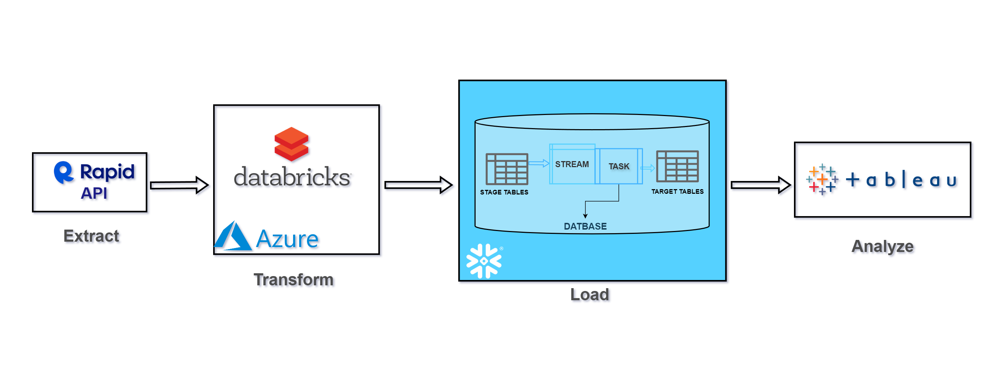
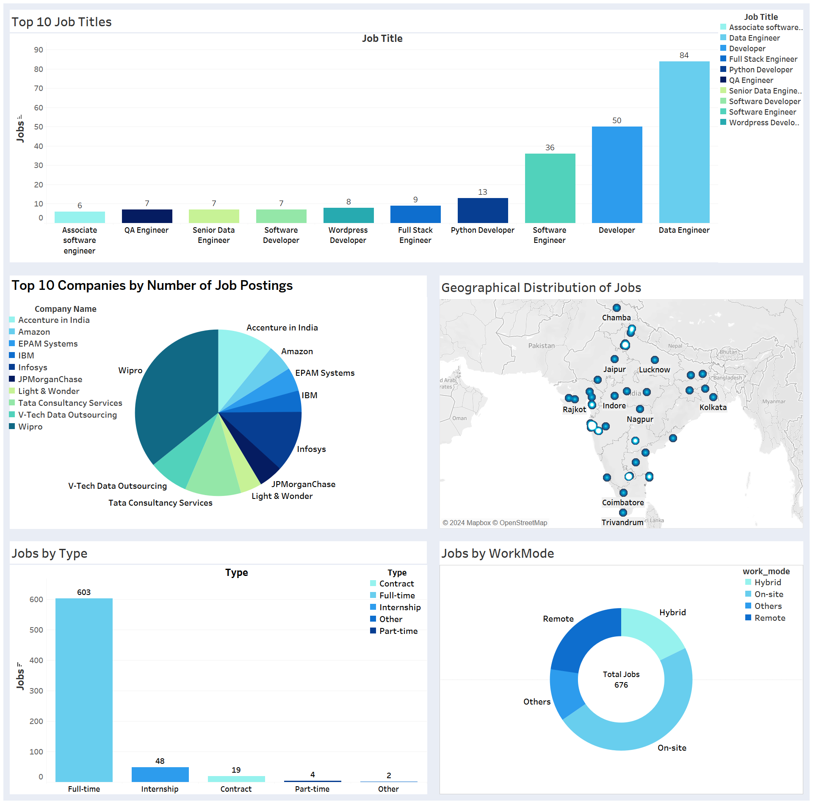

# **Linkedin_JobPost_Analysis**

## **Overview**
linkedin-jobPost-analysis is an end-to-end Data Engineering project focused on building comprehensive ETL(Extract,Transform,Load) pipeline to fetch,process,store and analyze the Linkedin job postings.Providing valuable insights into Job market trends.  
In this project,we building an ETL pipeline  using Rapidapi's `Rapid Linkedin Jobs API` to fetch the linkedin job post data,Azure databricks to perform transformation databricks,Snowflake for data warehouse and finally Tableau to perform data analysis and visualization.


## **System Architecture**


## 1 **Extract:** 
- We used `Rapidapi's` `Rapid Linkedin Jobs API` to fetch data for our project.   
- To retrieve data from the API, we utilized the Python `requests` library.

## 2 **Transform:**
+ The API data is ingested into the Azure Databricks.  

+ In Databricks, we performed data cleaning and transformed the data according to our need before loading to the Snowflake data warehouse.

+ To automate the data ingestion,transformation we scheduled the a databricks job.


## 3 **Load:**
- Initially the transformed data is loaded into the intermediate staging tables.
- Then the data is loaded into the main schema.
- The main schema of the data warehouse is a  `Dimensional` schema model
- Loading data from staging tables to the main schema is managed by Snowflake Tasks, which automatically move data to the main tables as soon as it is ingested into the staging table.  
- The Snowflake task is trigerred by a Snowflake Streams, which are created on the staging tables.
### Snowflake Warehouse Schema
#### Fact Table:
**post_fact**
```
post_id,id,reference_id,company_key,job_key,date_key
```

#### **Dimension Table:**
**company_dim**
```
company_key,id,company_id,company_name,company_url
```
**job_dim**
```
job_key,id,title,type,location,job_url
```
**date_dim**
```
date_key,id,date,year,month,dayOfMonth,dayOfweek
```


## 4 **Analyze:** 
These are the following analysis performed in Tableau to get the various insights on job posting on Linkedin.

- Top 10 Job Titles 
- Top 10 Company by Number of Job Posted
- Geographic Distribution Of the Jobs
- Jobs by Type
- Jobs Work Mode



## **Project Files**
+ `linkedin_jobPosting_analysis.ipynb` The databricks notebook for data processing and transformation.
+ `stg_schema.sql` file contains SQL statemnts to create staging tables in Snowflake.

+ `schema.sql` contains the SQl statemnts to create the main tables in Snowflake.

+ `snowflake_task.sql` is a SQL script to create Snowflake Streams and Snowflake task for auto transfer of data from stageing table to main table.


## **Technologies**
+ Python
+ SQL
+ Rapidapi
+ Microsoft Azure
+ Azure Databricks
+ Snowflake
+ Tableau

